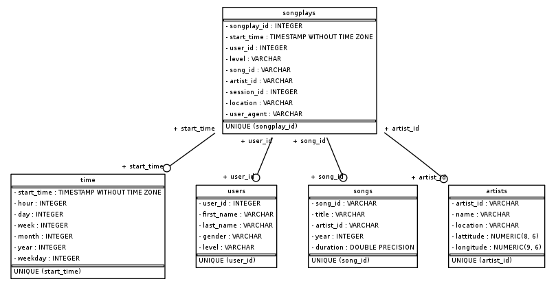

### Project Description
We will be implementing a postgres RDMS for a dimensional model for a Sparkify database.
In this project,we are provided with the raw log data of user using the web site to listen to the music. It consists of the userid, the song play by user and several other information. In addition, we are provided with the raw song data which have the detail of each song available within the site. Both data are in json format. 
We are going to load the data into the below dimensional model

### Database design
The database design consists of five tables:
1. songplays - the fact table
2. songs  - the dimension table that consists of the song information
3. artists - the table consists of the artist information
4. time - the time table 
5. user - the list of users

ER Diagram as below:

### ETL Process
The ETL process is fully done using postgres SQL and steps as below:
1. Create the database if not exists
2. Create the Fact and Dimension Table outline above
3. Insert the data based on the defined Fact and Dimension Model schema
4. Resolve duplicate data using "ON CONFLICT" (either upsert or ignore)

### How to Run
1. Run "python create_table.py"
  1. Note: The script will drop and create a database each time it runs, you can turn this off by running "python create_table.py False"
3. Follow by "python etl.py"

### Repository Files
Inside the repository, we have a total of 3 main .py script:
1. etl.py -- the ETL Process
2. sql_queries.py -- consist all the drop, create, insert queries
3. create_table.py -- the create db and table process

